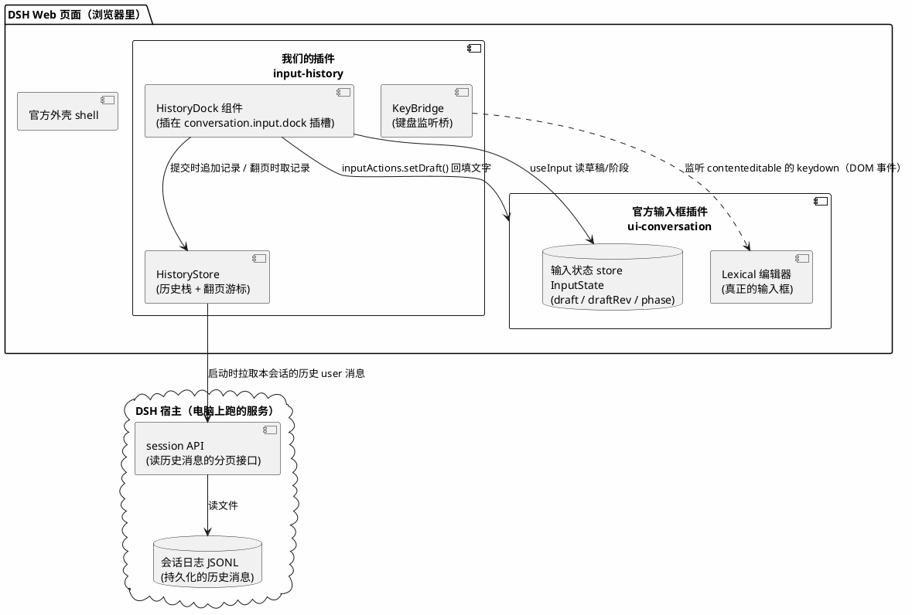
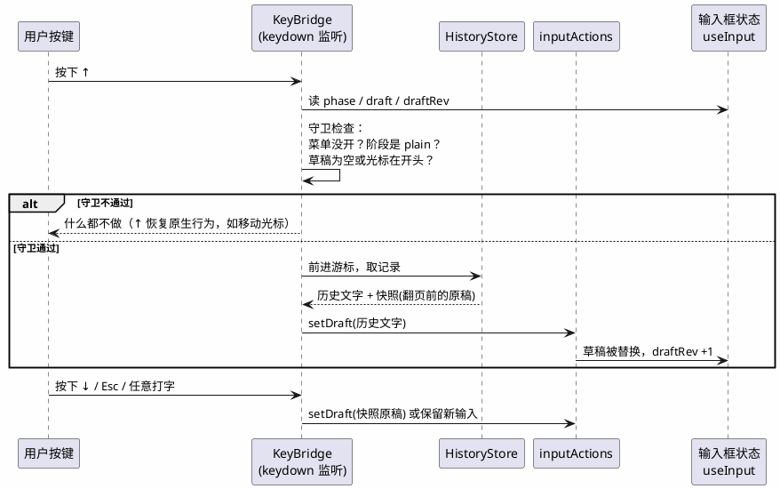
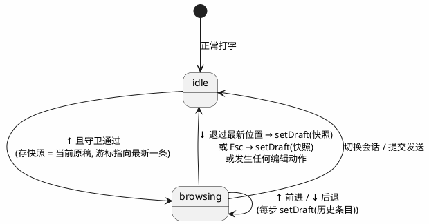

# dsh-plugin-input-history 详细设计

> 给 DSH Web 对话区加一个「按 ↑ 调出上一次输入」的客户端插件。
>
> 写作视角：假设读者是**一个学过一点编程的高中生**——不懂的名词都会现场解释，但方案本身是认真可落地的工程方案。

---

## 目录

1. [我们要做什么](#1-我们要做什么)
2. [背景知识：五个名词](#2-背景知识五个名词)
3. [总体方案](#3-总体方案)
4. [详细设计](#4-详细设计)
5. [代码骨架](#5-代码骨架)
6. [怎么装进 DSH](#6-怎么装进-dsh)
7. [怎么测试、怎么证明它是对的](#7-怎么测试怎么证明它是对的)
8. [风险与边界情况](#8-风险与边界情况)
9. [名词小抄](#9-名词小抄)

---

## 1. 我们要做什么

**问题**：在 DSH 的网页聊天界面里，你发出去的消息就"飞走了"。想改一改刚才那句话重新发，只能用鼠标去聊天记录里选中、复制、粘贴。终端（黑底命令行）里有个经典好用的功能：按 **↑ 方向键**，上一条命令就回来了；再按一下 ↑，更早的那条也回来了。DSH 的输入框目前**没有**这个功能（我们查过它的前端代码确认了这一点）。

**目标**：做一个 DSH 客户端插件，让输入框支持：

| 按键 | 行为 |
|---|---|
| `↑` | 调出上一条发送过的输入（再按继续往前翻） |
| `↓` | 往回翻；翻到最新位置后恢复"翻历史之前你正在打的字" |
| `Esc` | 放弃翻历史，恢复原稿 |
| 任意打字 | 自动退出"翻历史模式"，不覆盖你新打的内容 |

**一句话总结**：把终端的输入历史体验搬到 DSH 的聊天输入框里。

---

## 2. 背景知识：五个名词

用做汉堡来打比方，理解 DSH 前端的结构：

**① 插件（plugin / cordis 插件）**
DSH 的整个界面不是一整块代码，而是由很多独立的"积木"拼起来的，每块积木叫一个插件。官方的聊天区、侧边栏、设置页都是插件。你也可以写自己的积木插上去——这就是我们接下来要做的事。

**② Composer（输入框区域）**
就是你打字、点发送的那个区域。官方负责它的插件叫 `dsh-client-ui-conversation`。

**③ Slot（插槽）**
官方插件在界面上留了很多"空插座"，写着"这里允许别的插件放东西"。比如 `conversation.input.dock`（输入框卡片上方的一排位置）、`conversation.composer.dock`（输入框下方）。我们的插件可以把自己的小组件插进这些插座。

**④ InputActions / useInput（官方留的"遥控器"）**
更妙的是：插进插座的小组件，官方会塞给它两个工具（作为 React props）：
- `useInput`：随时读到输入框的**当前状态**——草稿文字、编辑器版本号 `draftRev`、当前阶段（`plain` 正常 / `submitting` 发送中等）。
- `inputActions.setDraft(text)`：一句话**替换整个草稿**。官方注释写明它就是给"程序化写入"用的——我们回填历史文字正是这个用途。

这两个都是公开契约（在 `dsh-client-ui-conversation` 的类型文件里），**不需要改官方代码**。

**⑤ 会话日志（session log / JSONL）**
你发过的每条消息都被永久记录在 `$DSH_HOME\sessions` 下的文件里。所以"历史输入"的数据源是现成的，不用我们额外记小本本。

---

## 3. 总体方案

### 3.1 架构总览



### 3.2 两个核心动作

**动作 A：记历史（数据从哪来）**

我们**不自己发明存储**，直接以会话日志里的 user 消息为准：

- 插件在会话打开时，通过 `session` 远程接口把本会话已有的 user 消息分页拉进 `HistoryStore`（新→旧排序，去重，最多保留 100 条）。
- 运行中：监听 `useInput` 的 `phase`——当一次提交从 `submitting` 回到 `plain`（即发送尘埃落定），把刚才发送的文字（从 transcript 投影读到的 durable user 消息）追加进栈。这样"发送失败的消息"不会进历史，和终端行为一致。

**动作 B：回填（怎么把文字放回输入框）**



### 3.3 状态机（HistoryStore 内部）



---

## 4. 详细设计

### 4.1 快捷键守卫（最重要的一节）

↑ 键在输入框里本来有合法用途（把光标移到上一行开头）。多行输入是刚需，所以我们定死这些守卫，全部通过才拦截 ↑：

| # | 守卫 | 为什么 |
|---|---|---|
| G1 | 输入法不在拼字中（`composition` 事件未激活） | 中文输入法正在选字时绝不能抢键 |
| G2 | `phase === 'plain'` | 正在发送/命令裁决时输入框状态受限，不动 |
| G3 | 触发菜单没开（`/` 命令菜单、`@` 引用菜单） | 菜单开着时 ↑ 是用来在菜单里移动高亮的，必须让位 |
| G4 | 草稿为空，**或**光标位于第一行行首 | 草稿有字且光标在中间/后面时，↑ 就是移光标 |
| G5 | 没有选中文本 | 有选区时 ↑ 可能是移动选区 |

G3 的判断来源：`useInput` 的状态 + `menuLauncher`/`lexicon` 快照不为打开态；若契约上拿不到确切的"菜单开着"信号，退化为"检测 draftRev 短时间内被菜单插入改变"的保守策略——**拿不准就让位**，这是本插件的最高原则：宁可功能不触发，绝不干扰原生行为。

### 4.2 HistoryStore 数据结构

```ts
interface HistoryEntry {
  readonly text: string;        // 用户当时发送的完整文字
  readonly seq: number;         // 来源会话事件的序号，用于去重与排序
}

interface HistoryState {
  readonly entries: readonly HistoryEntry[]; // 新→旧
  readonly cursor: number;      // -1 = 不在翻页；否则指向 entries 下标
  readonly snapshot: string | null; // 进入翻页那一刻的原稿
}
```

规则：

- **去重**：相同 `seq` 只收一次；相同 `text` 的连续条目合并（终端习惯：连续敲两次同一条命令，↑ 一次就到）。
- **上限**：每会话内存中最多 100 条，超出丢最旧的。
- **localStorage 持久化**（可选增强 v2）：按 sessionId 缓存，刷新页面后不用重新分页拉取。v1 先不做，保证正确性优先。
- **纯逻辑**：`push / advance / retreat / exit / reset` 全是 `(state, action) => state` 的纯函数，不碰 DOM——这是为了第 7 节的单测好写。

### 4.3 历史数据来源（精确到接口）

| 时机 | 来源 | 说明 |
|---|---|---|
| 会话打开 | `session` remote（`@deepseek-ai/dsh-api-session-controller` 客户端命名空间）的历史分页接口 | 从最新往旧拉 user 消息，拉到 100 条或拉完为止 |
| 运行中新增 | 监听 `useConversation` 快照里新出现的 durable user 消息 | transcript 里权威消息到达即追加；这天然排除发送失败、本地回显等临时状态 |
| 会话切换 | `sessionOf(actx)` 变化时 `reset()` | 每个会话有独立的历史栈 |

### 4.4 回填的实现

用 `inputActions.setDraft(text)` 整体替换草稿。注意三点：

1. **setDraft 会清掉附件吗？** 不会——附件是独立的 `attachmentIds` 列表，setDraft 只管文字。翻历史时附件保留原样，这是合理行为（文档里写明）。
2. **undo（撤销）**：Lexical 编辑器有自己的撤销栈，setDraft 属于程序化写入；翻页的每一步都会进入可撤销范围。我们不额外处理，但在文档里注明：Esc 恢复快照是主路径，Ctrl+Z 是兜底。
3. **draftRev**：每次 setDraft 后 `draftRev` 会 +1。KeyBridge 在每次按键处理完后重新读最新的 state，不缓存旧值——避免"拿着过期的草稿快照做决定"这类竞态。

### 4.5 键盘监听怎么挂（KeyBridge）

`ComposerKeyboard` 是官方包私有的（类型文件里明确写了 "package-internal, never across a plugin boundary"），所以我们**不走官方键盘管线**，改用标准 DOM 方案：

- HistoryDock 组件挂载时，`addEventListener('keydown', handler, true)` 绑在 composer 卡片的 DOM 容器上（捕获阶段，先于编辑器内部处理）；
- 判断事件目标是否在 contenteditable 内，是且守卫通过才 `preventDefault()` 并处理，否则完全放行；
- 组件卸载时移除监听，绝无泄漏。

这个方案的代价：它是"从外面往里看"，不如官方内部管线优雅，但完全基于公开 slot 契约 + 标准 DOM，官方升级时最不容易坏。

### 4.6 UI（HistoryDock 长什么样）

v1 尽量安静：

- 默认**不渲染任何可见元素**（返回 null），只负责挂键盘监听和逻辑；
- 翻页中，在 composer 卡片内浮现一个 2 秒自动消失的小气泡提示：「历史 3/17」（当前是第几条 / 共几条），可后续再加常驻按钮。
- 插进 `conversation.input.dock`（list 插槽，天然支持多个插件共存，顺序无关）。

---

## 5. 代码骨架

目录结构（npm 包形制，与官方客户端插件一致）：

```
dsh-plugin-input-history/
├── package.json            # 含 dsh.client 声明（见第 6 节）
├── tsconfig.json
├── src/
│   ├── index.ts            # 宿主侧入口：注册插件（cordis plugin）
│   ├── client/
│   │   ├── index.ts        # 浏览器侧入口：向插槽注册 HistoryDock
│   │   ├── store.ts        # HistoryStore 纯函数（★ 单测主战场）
│   │   ├── guards.ts       # G1–G5 守卫纯函数（★ 单测主战场）
│   │   ├── keybridge.ts    # DOM keydown 绑定（薄壳，尽量少逻辑）
│   │   └── HistoryDock.tsx # slot 组件：装配以上零件
│   └── locale.ts           # 「历史 3/17」等文案（中英双语）
└── docs/
    └── design.md           # 本文档
```

关键代码示意（非完整实现，表达设计意图）：

```ts
// guards.ts —— 纯函数，输入都是可序列化的数据，方便单测
export function shouldInterceptArrowUp(input: {
  phase: InputState['phase'];
  draft: string;
  caretLine: number; caretCol: number;   // 由调用方从 DOM selection 算好传入
  hasSelection: boolean;
  composing: boolean;
  menuOpen: boolean;
}): boolean {
  if (input.composing) return false;                    // G1
  if (input.phase !== 'plain') return false;            // G2
  if (input.menuOpen) return false;                     // G3
  if (input.hasSelection) return false;                 // G5
  const atStart = input.caretLine === 0 && input.caretCol === 0;
  return input.draft === '' || atStart;                 // G4
}
```

```tsx
// HistoryDock.tsx —— 插槽组件拿到的 props（官方 SessionStandardProps）
export function HistoryDock({ useInput, inputActions }: SlotProps) {
  const input = useInput(s => s);
  const store = useSessionHistoryStore();      // 按 sessionId 隔离
  const ref = useRef<KeyBridge | null>(null);

  useEffect(() => {
    ref.current = new KeyBridge({ input, inputActions, store });
    return () => ref.current?.dispose();
  }, []);

  return null;  // v1 不渲染可见内容
}
```

---

## 6. 怎么装进 DSH

### 6.1 package.json 里的"自报家门"

DSH 的浏览器模块系统（`dsh-client-modules`）扫描每个插件包的 `package.json`，读到 `dsh.client` 声明就自动把它变成浏览器可加载的 bundle——不需要任何手工接线：

```jsonc
{
  "name": "@example/dsh-plugin-input-history",
  "version": "0.1.0",
  "exports": { "./client": "./lib/client/index.js" },
  "dsh": {
    "client": {
      "platform": "web",
      // 基座（React / Cordis / 官方 UI 库）之外的依赖要在这里点名：
      "external": ["@deepseek-ai/dsh-client-ui-conversation/client"]
    }
  },
  "dependencies": {
    "@deepseek-ai/dsh-client-ui-conversation": "*"
  }
}
```

构建要求：宿主只提供**已构建**的 `lib/client.js`，所以发布前必须跑一次构建产出 `lib/`，缺了会在激活时报错并明确告诉你哪个包缺 bundle。

### 6.2 挂到 web profile

profile（配置档案）就是 `$DSH_HOME/profiles/web` 目录，里面有 `package.json`（记录装了哪些树外插件）和 `cordis.patch.yml`（用户自己的配置叠加层）：

```sh
# 1. 把包装进 web profile（内部转发给 pnpm）
dsh plugin --profile web add file:E:\prog\dsh-plugin-input-history

# 2. 在 cordis.patch.yml 中启用它并挂上插槽（示意）
#    插槽注册的具体 yml 键名以 dsh-client-ui-slots 的装载写法为准，
#    开发时用下面第 3 步的 dump 命令核对。
# 3. 不启动、只检查合成后的配置树，确认我们的插件出现在图里：
dsh --profile web --dump-config
```

验证挂载成功的三个信号：`--dump-config` 里能看到包名；启动后浏览器 DevTools 的 Network 里出现 `/plugins` 下的我们的 bundle；Console 无激活报错。

---

## 7. 怎么测试、怎么证明它是对的

证明分四层，从便宜到贵，一层层往上叠。核心思路：**把逻辑做成纯函数先测透，再测装配，最后人肉验收**。

### 第一层：纯函数单元测试（自动化，跑得飞快）

`store.ts` 和 `guards.ts` 不碰 DOM、不碰 React，输入输出都是普通数据——用 vitest 直接喂表格：

```ts
// store.test.ts —— 每行都是一个"如果…那么…"的事实
describe('advance / retreat', () => {
  it('空历史时按 ↑ 不进入翻页', () =>
    expect(advance(idleState([])).cursor).toBe(-1));

  it('翻到最旧一条后继续按 ↑ 停在原地', () =>
    expect(advance(browsingAt(oldest)).cursor).toBe(0));

  it('在最新位置按 ↓ 退出翻页并恢复快照', () => {
    const s = retreat(browsingAt(0));   // 游标已是最新
    expect(s.cursor).toBe(-1);
    expect(s.snapshot).toBe(null);
  });

  it('连续重复的发送只占一个历史位', () => { /* push('a'), push('a') → len 1 */ });
});

describe('shouldInterceptArrowUp', () => {
  it('G1：IME 拼字中绝不拦截');
  it('G2：phase 非 plain 绝不拦截');
  it('G3：菜单开着绝不拦截');
  it('G4：草稿非空且光标不在第一行行首 → 不拦截（多行移动光标）');
  it('G4：草稿为空 → 拦截');
});
```

**证明力**：历史栈的每条规则、每个守卫的每个分支，都有明确的"给这个输入必须得这个输出"。这条不通过，功能逻辑就是错的，后面全免谈。

### 第二层：组件级测试（jsdom 模拟浏览器）

用 Testing Library 渲染 HistoryDock，伪造 keydown 事件：

- 按序列 `输入"你好" → 发送 → ↑`，断言 `setDraft` 被以 `'你好'` 调用；
- `↑ ↑ ↓ Esc` 组合拳，断言草稿轨迹 `a → b → a → 原稿`；
- 监听器卸载后按键不再有任何效果（无内存泄漏）。

**证明力**：零件装在一起能转，且拆卸干净。

### 第三层：真实构建 + 挂载冒烟测试

1. `pnpm run build` 成功产出 `lib/client/index.js`（没有它宿主会大声报错——这本身就是一道测试）；
2. `dsh --profile web --dump-config` 输出里含本包；
3. 启动 `dsh web`，打开页面，DevTools Network 里 `/plugins` 返回我们的 bundle，Console 无红字。

**证明力**：插件真的被 DSH 认领并加载了，不是自说自话。

### 第四层：人工验收清单（最终裁判）

在真实浏览器里逐条打勾：

| # | 操作 | 期望 |
|---|---|---|
| 1 | 发两条消息，输入框空着按 ↑ | 出现第 2 条（最新）；再按 ↑ 出现第 1 条 |
| 2 | 正在打一半的字按 ↑（光标在行中） | 无反应，↑ 只是移光标，草稿完好 |
| 3 | 打一半的字，光标移到最前面按 ↑ | 进入翻页；按 ↓ 或 Esc 后原稿**一字不差**回来 |
| 4 | 中文输入法拼音拼到一半按 ↑ | 候选窗正常，不触发历史 |
| 5 | 输入 `/` 打开命令菜单后按 ↑ | 菜单里移动高亮，不触发历史 |
| 6 | 发送一条消息但网络失败 | 这条**不进**历史（↑ 翻不到它） |
| 7 | 多行草稿，光标在第 3 行按 ↑ | 光标移到第 2 行，不触发历史 |
| 8 | 翻出历史后直接点发送 | 发送的就是那条历史内容（终端同款行为） |
| 9 | 切到另一个会话按 ↑ | 只翻出新会话自己的历史 |
| 10 | 带 1 张图片发送后按 ↑ | 文字被调出，图片附件仍在草稿上 |

**证明力**：第 2、4、5、7 条合起来证明"**绝不干扰原生行为**"；第 1、3、10 条证明"**核心功能可用且可撤销**"；第 6 条证明"与官方语义一致"。全部通过，才算做完。

---

## 8. 风险与边界情况

| 风险 | 应对 |
|---|---|
| 官方未来给 composer 自带 ↑ 历史 | 插件是独立包，直接卸载即可（`dsh plugin --profile web remove ...`），零残留 |
| `menuOpen` 信号拿不准 | 保守策略：宁可让位不拦截（4.1 节），最坏情况是功能偶尔不触发，绝不是输入被吃掉 |
| 超长会话历史拉取慢 | 只拉最近 100 条；localStorage 缓存（v2）后基本零请求 |
| setDraft 与用户打字的竞态 | 每次按键处理后重读最新 `draftRev`；browsing 状态下任何真实编辑动作立即退出翻页 |
| Windows / macOS 键盘差异（如 Option+↑） | 只拦截**裸** ↑/↓（无修饰键），带修饰键的一律放行 |

---

## 9. 名词小抄

| 名词 | 人话解释 |
|---|---|
| profile | DSH 的一套"装配清单"：装了哪些插件、按什么顺序叠加配置。`web` 就是对应网页版的那套 |
| cordis | DSH 用的插件框架，负责把积木们组装、启动、通信 |
| slot / 插槽 | 官方界面预留的"空插座"，别的插件可以申请把自己的组件插进去 |
| Lexical | Facebook 出的网页富文本编辑器库，DSH 输入框的底层 |
| IME composition | 输入法拼字状态：比如拼音打到一半还没选字 |
| JSONL | 每行一个 JSON 对象的文本文件，DSH 拿它存会话记录 |
| 纯函数 | 只看输入算输出、不碰外面世界的函数——最好测的一种代码 |
| 冒烟测试 | 最基本的"通电看会不会着火"式检查：能启动、能加载、无报错 |

---

## 10. 实现纪要（as-built，v0.1.0）

> 本节记录**实际实现**与前期设计的差异，以实现为准。

### 10.1 与设计的差异

| 设计（§3.2 / §4.3） | 实际实现 | 原因 |
|---|---|---|
| 历史数据源：session 历史分页接口冷启动播种 + phase 相位观测增量 | **提交手势 + 草稿清空确认**（见 10.2） | 实测发现 DSH 普通消息是乐观提交：Enter 一按草稿立即清空，`InputState.phase` 全程保持 `plain`，相位观测永远等不到信号 |
| menuOpen 信号来自 `lexicon`/`menuLauncher` 快照 | **DOM 探测**：composer 卡片内是否存在 `[role="listbox"]` / `[role="dialog"]` | `ComposerKeyboard`/`menuLauncher` 是官方包私有注入，不跨插件边界传递 |
| `ConversationSnapshot` 读 transcript 播种历史 | 放弃：快照不暴露消息内容 | 该快照只含 `views`/`activeTargets` |

### 10.2 as-built 的记录规则

1. **手势捕获**：document 捕获阶段监听两种手势——composer 内按 Enter（无修饰键）、composer 卡片内任意按钮上的 pointerdown（覆盖点发送按钮）；手势发生时快照当前草稿；
2. **提交确认**：手势后 3 秒内草稿被清空（= 发送成功）→ 入栈；失败时草稿被官方恢复（不清空）→ 自动跳过；
3. 保留 phase 捕获（`claimed`/`submitting` 等相位下非空草稿）作为命令流等场景的次要路径。

### 10.3 实测抓出的三个 bug（记录给后来者）

| Bug | 根因 | 修复 |
|---|---|---|
| 按历史功能"完全没反应" | `keybridge.js` 用了 `exit()` 却忘了 import；esbuild 不查未定义标识符、tsc 未开 `checkJs`，双双漏网 | 补 import；建议后续开启 `checkJs` |
| ↓ 时气泡数字变但输入框内容不变 | ↓ 分支只移动游标、漏了把新条目 `setDraft` 回编辑器（只有"退出恢复原稿"分支写了） | 退出时写快照、否则写当前条目 |
| 空历史按 ↑ 无任何反馈 | 设计如此（`begin` 在空栈上是 no-op） | 保持静默；可考虑 v2 加 toast 提示 |

### 10.4 部署实测要点

- profile 的 `dsh.profile.bundles` 里每个包**必须自带 `cordis.patch.yml`**（插入插件行），否则 `dsh web` 启动直接崩溃（`failed to read overlay`）；
- 运行中的 dsh web 会锁住 `node_modules` 里已加载的原生模块，`pnpm install --force` 会因此失败且**留下半安装状态**（清单有条目、目录被删 → 下次启动崩溃）；可靠部署方式：先 `Remove-Item` 旧目录再整目录拷贝；
- 客户端 bundle 只在服务启动时快照，**改 bundle 必须重启 `dsh web`** 才会发布（无 HMR 驱动时）；
- 诊断日志用 `console.log` 而非 `console.debug`（后者默认被 DevTools 过滤器隐藏）。
